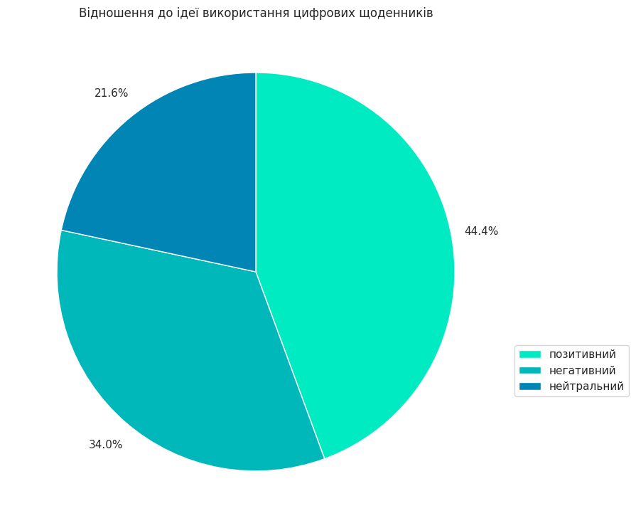
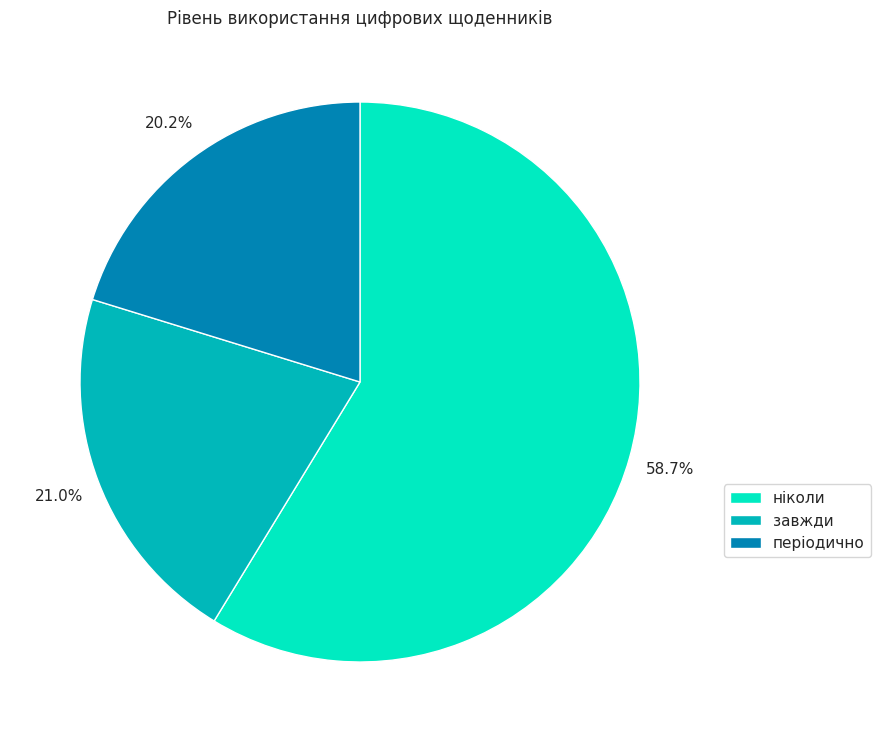
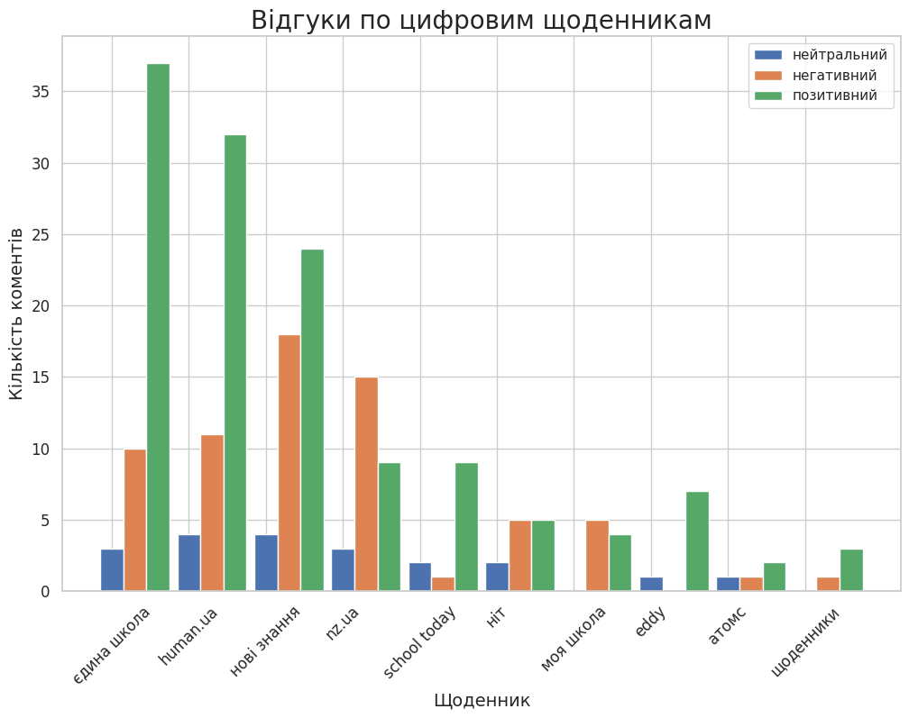

# Decription:
This project dedicated for analysis of comments from Telergam using GPT-like models. It includes calling Telegram API and OpenAI GPT3-turbo and following analysis and visualization of the data.

# Instalation
```bash
git clone git@github.com:Ingvarstep/telegram-comments-analysis.git
cd telegram-comments-analysis
python -m venv .venv
.venv/scripts/activate
pip install -r requirements.txt
```

# Structure of the repo:
* data - all raw and processed data;
    * messages.json - raw list of comments from the post;
    * responses.json - raw annotated by GPT comments;
* imgs - all graps generated after analysis of comments;
* src - source code to make analysis;
    * get_comments.py - calls Telegram API to get comments from concrete post;
    * comments_processing.py - annotate comments using GPT-3.5 turbo;
    * get_stats.py - analyze annotated comments and visualize it;

# Reprodusing 
To reproduce run python script in the following order:
```bash
python3 src/get_comments.py 
python3 src/comments_processing.py 
python3 src/get_stats.py 
```

# Information analyzed:
 * city - city of a school mentioned in a comment;
 * oblast - oblast of a school mentioned in a comment;
 * school - school mentioned in a comment;
 * type - digital journal type mentioned in a comment;
 * usage - how often digital journals are used according to a comment;
 * sentiment - sentiment of a comment;

# Graphs:




